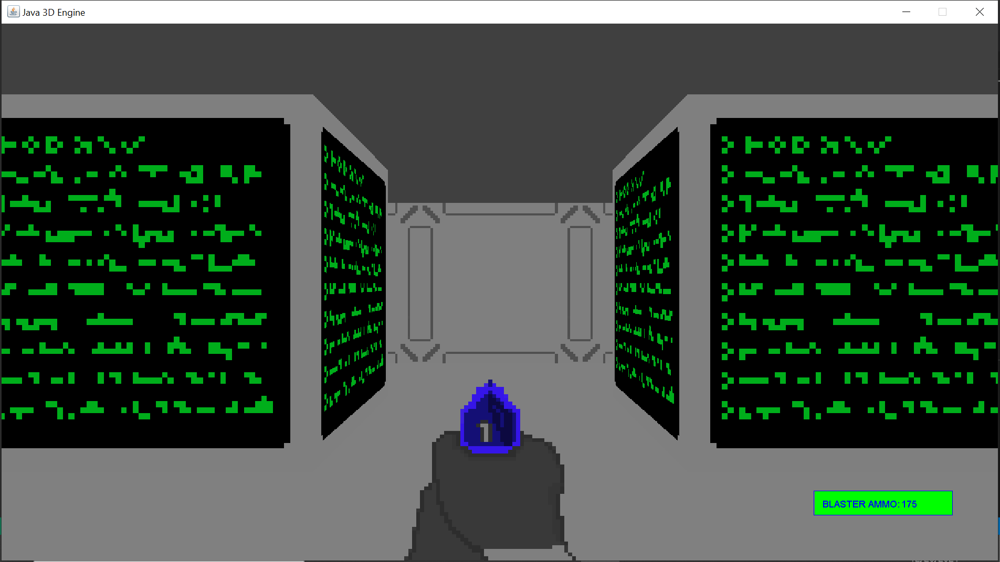
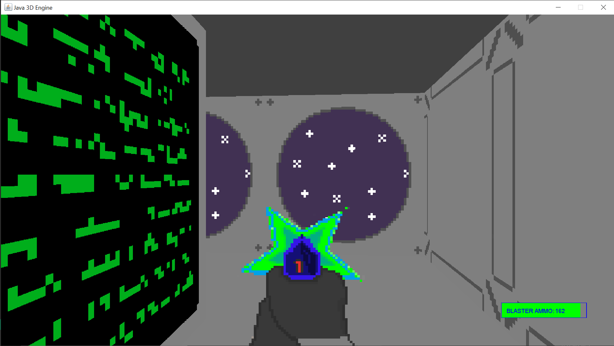
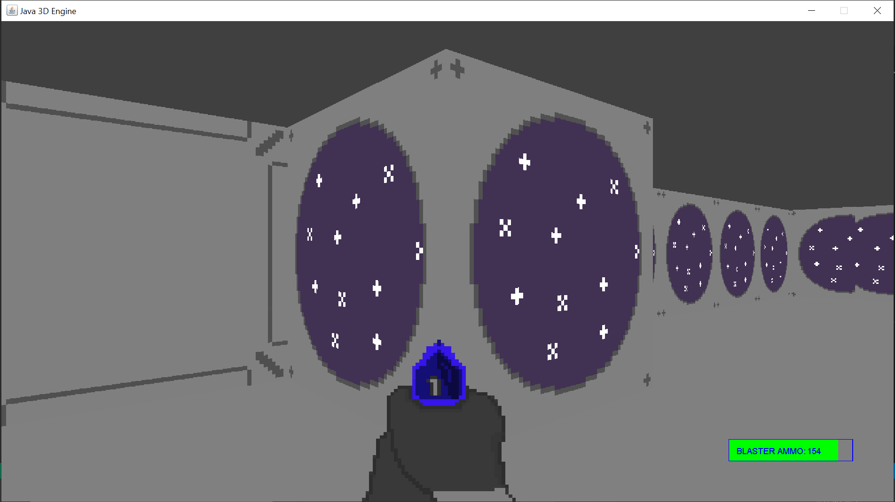

# Java Raycasting 3D engine
Created for the PennApps16 hackathon @ UPenn. Written in Java and utilizes raycasting to achieve a 3D appearance similar to popular 90s PC games like DOOM.
To Run:
  - open and compile Game.java in an IDE

Screenshots

